# High-Level Architecture / High-Level Design: Traveller_TNE Archive Site

**Status:** Draft
**Derived from:** [srs.md](srs.md), [concept.md](concept.md), [data-structures.md](data-structures.md)

This document makes the concrete technology and architecture decisions that the SRS deliberately left open. Where a choice has real alternatives, the alternatives considered and the reason for the pick are given briefly — this is not meant to be an exhaustive bake-off, just enough to make the decision auditable later. Field-by-field data schemas and module/script-level breakdown belong in the DD, not here.

## 1. Architectural overview

Three independent stages, each reading only the output of the one before it — this directly implements DR-6 (downstream tools never touch the raw mbox/Mork files) and keeps the messy, one-time "parse Yahoo's HTML" problem fully isolated from the "build a good website" problem.

```mermaid
flowchart LR
    subgraph Source["Source (read-only)"]
        MBOX["mail_archives/YahooArchive<br/>(mbox, 724 records)"]
    end
    subgraph ETL["ETL — Python (make data)"]
        E1["Parse mbox + expand digests"]
        E2["Dedupe via Yahoo permalink ID"]
        E3["Resolve threads"]
        E4["Normalize dates to UTC"]
        E5["Strip boilerplate + emails"]
    end
    subgraph Data["Canonical dataset"]
        JSON["data/posts.json<br/>(committed to repo)"]
    end
    subgraph Files["Attachment source"]
        ATT["attachments/&lt;id&gt;/&lt;filename&gt;<br/>(sparse — added over time)"]
    end
    subgraph Build["Site build — Eleventy (make build)"]
        SSG["Nunjucks templates<br/>+ canonical dataset<br/>+ attachment presence check"]
    end
    subgraph Index["Search index — Pagefind (make index)"]
        PF["Crawl built HTML,<br/>emit stemmed index"]
    end
    subgraph Deploy["GitHub Actions → GitHub Pages"]
        SITE["Static site output"]
    end

    MBOX --> E1 --> E2 --> E3 --> E4 --> E5 --> JSON
    JSON --> SSG
    ATT --> SSG
    SSG --> SITE
    SITE --> PF
    PF --> SITE
```



`YahooArchive.msf` (Mork) appears nowhere in this diagram — per DR-6/DR-7 it's a development-time cross-check only, never a pipeline input.

## 2. Technology stack decisions

| Concern | Decision | Rationale | Alternatives considered |
|---|---|---|---|
| **ETL language** | Python 3 | Already used for the source analysis in data-structures.md (`mailbox`, `email` stdlib modules) — no reason to switch tooling mid-project. `BeautifulSoup`/`lxml` for the digest-HTML parsing (DR-5). | N/A — this one wasn't really in contention. |
| **Static site generator** | **Eleventy (11ty)** | Zero opinion on content shape — takes arbitrary JSON as a global data source, which is exactly what a 700+-entry non-blog-shaped dataset (posts/threads/authors/topics/years, all cross-linked) needs. Fast incremental builds, first-class GitHub Pages/Actions deployment story, output is plain HTML/CSS/JS with nothing framework-specific shipped to the browser — which is what keeps NFR-5 (Lighthouse 90+) easy rather than a fight. | **Hugo** — comparable fit and faster builds, but Go templates are more awkward for the amount of hand-written, accessibility-sensitive markup this project needs than Nunjucks/JS. **Pelican** — natural Python-ecosystem fit, but more blog-post-shaped and less flexible for the thread/author/topic cross-indexing this site needs. **Astro** — great DX and also outputs zero-JS-by-default, but its component model is overkill for content that's fundamentally "many pages from one big JSON file," and it pulls in a heavier Node toolchain for no corresponding benefit here. |
| **Templating** | Nunjucks (11ty's native default) | Direct control over every element for accessibility (landmarks, heading structure, native `<dialog>`, etc.) without a component-framework abstraction in the way. | — |
| **Search** | **Pagefind** | Purpose-built for exactly this problem: it indexes *already-built static HTML* as a post-build step (no separate content pipeline to keep in sync), ships a small WASM+JS bundle loaded lazily, includes stemming, ranking, and excerpt/highlight generation out of the box — directly satisfying FR-9–FR-13 without hand-rolling an inverted index. SSG-agnostic, so it has no opinion about Eleventy either. This *is* the "generate a stemmed index" Makefile target from concept.md §10. | **Lunr.js / elasticlunr** — solid libraries, but the index is built from a document collection you assemble and ship to the client yourself; more moving parts, and Pagefind's built-from-final-HTML approach means the index can never drift out of sync with what's actually rendered. **Custom inverted index** — full control, but reimplements stemming/ranking/highlighting that Pagefind already provides, tested, for free; not worth the risk for a first release. |
| **Styling** | Hand-written modern CSS (custom properties, `prefers-color-scheme`, no framework) | Keeps shipped CSS minimal (Lighthouse/NFR-6), and modern CSS (Grid, Flexbox, logical properties, `:has()`) is fully capable of the layout this site needs without a framework's unused-class overhead. | Tailwind/Bootstrap — viable, but add build complexity and shipped-weight risk for a site whose whole design brief is "content-focused, minimal chrome" (concept.md §8). |
| **Build orchestration** | Makefile wrapping `npm`/`npx` (Eleventy, Pagefind) and `python3` (ETL) | Matches concept.md §10's stated direction; gives one entry point regardless of which language underlies a given step. | — |
| **CI/CD** | GitHub Actions → GitHub Pages (`actions/deploy-pages`) | Satisfies NFR-9 directly; no other hosting/CI account needed (IR-1). | — |

## 3. Canonical dataset — representative schema

The DD will define the authoritative field-by-field schema; this is the shape that drives the rest of this document's decisions:

```json
{
  "id": "6312",
  "source_kind": "digest | relayed | direct",
  "subject": "Possibly useful colony info",
  "subject_normalized": "possibly useful colony info",
  "author": { "display_name": "DED", "profile_handle": "dedtraveller" },
  "date_utc": "2008-11-16T21:36:00Z",
  "date_original": "Sun Nov 16, 2008 1:36 pm (PST)",
  "body_html": "<p>...</p>",
  "thread_id": "t-6312",
  "parent_id": null,
  "reply_ids": ["6318", "6321"],
  "attachments": [
    { "filename": "TimeToOrbit.xls", "source": "mime_embedded" }
  ],
  "yahoo_url": "http://groups.yahoo.com/group/Traveller_TNE/message/6312"
}
```

Notes intentional to this design:
- `id` is the Yahoo permalink message ID (DR-2's dedup key) wherever one exists; for pre-digest-era or otherwise permalink-less posts, a stable synthetic ID is generated once and never recomputed. No email address field exists anywhere in this schema (DR-4/FR-4) — `author` carries only what's needed for FR-5/FR-15.
- Both `date_utc` and `date_original` are always present (DR-3).
- `attachments[]` entries in `data/posts.json` carry only `filename` and `source` — never an `available` field. Availability is computed at *build* time from DR-8's attachment source folder, into the Eleventy data layer (dd.md §7.1), not stored in the committed dataset at all. This is what makes FR-27's "add a file, rebuild, done" behavior clean: there's no stale boolean anywhere that could disagree with reality between commits.
- `yahoo_url` is retained purely as dead provenance metadata (Yahoo Groups no longer resolves it) — useful for citation/verification during development, not a working link on the live site.

## 4. Threading algorithm

A real constraint drives this design: only non-digest posts (kind A/B in data-structures.md §2 — individually mailed or Yahoo-relayed, roughly 210 of the source records) ever had a genuine RFC `Message-ID`/`In-Reply-To`/`References`. Digest-embedded posts (the majority of actual post *content*, once expanded) were extracted from HTML with no email headers at all — they only ever have the Yahoo permalink ID, subject, author, and date. So header-based threading can only ever link a kind-A/B post to another kind-A/B post; it can never directly resolve a reply relationship into or out of a digest-derived post. This isn't a bug to fix — it's an intrinsic property of the source data, and FR-6's fallback tier exists precisely because of it.

Algorithm (implements FR-6):

1. **Build a `Message-ID → post id` lookup** across every kind-A/B post that has one.
2. **Header pass**: for each kind-A/B post with `In-Reply-To` and/or `References`, resolve the referenced `Message-ID`(s) against that lookup; if found, set `parent_id` to the resolved post. (This will only ever succeed against another kind-A/B post, per the constraint above.)
3. **Subject-fallback pass**: for every post *not* assigned a parent in step 2 (which includes all digest-derived posts, and any kind-A/B post whose reply target isn't in the lookup), normalize its subject (strip `Re:`/`Fwd:`/`[Traveller_TNE]` prefixes, case-fold, collapse whitespace) and group all posts sharing that normalized subject. Within each group, sort by `date_utc`; the earliest post is the thread root, and each subsequent post's `parent_id` is set to the *immediately preceding* post in that same time-ordered group (a linear chain, not an attempt to infer branching structure we have no evidence for).
4. **Thread assembly**: `thread_id` is the root post's `id` for every post reachable from it via `parent_id` chains (either source); `reply_ids` on each post is simply the set of posts pointing to it as `parent_id`.
5. **Cross-check (DR-7)**: compare the resulting thread-count/singleton-count distribution against the Mork-derived 472/580 figures from data-structures.md §4.2 as a development-time sanity signal only.

This is a heuristic, not a guarantee of factually correct reply structure, and is documented as such — consistent with data-structures.md's finding that even Thunderbird's own algorithm resolved the large majority of this archive's threads as singletons.

## 5. Digest expansion, deduplication & attachment pipeline

1. Parse each mbox record; if it's a digest (`Subject` contains `Digest Number`, or more robustly, presence of the `<h1>Messages</h1>` structural marker from data-structures.md §2.1), expand every `<dl>` entry under it into a distinct post record; otherwise the mbox record maps 1:1 to a post record.
2. Deduplicate the resulting full post list by Yahoo permalink ID (DR-2) — last-seen-wins is fine given the source is static and finite; there's no "correct" version to prefer once permalink-equal.
3. For each post, look up whether it references a named attachment (from the source MIME parts for kind-A/B, or none for digest-derived posts — digests never carried the actual binary, only the notification/link) and whether a matching file exists under the DR-8 attachment source folder (keyed by permalink ID + original filename); set `attachments[].available` accordingly.
4. Copy every *present, matched* attachment file into the Eleventy build output alongside its owning post's page.

## 6. Site information architecture

| Path | Page | Satisfies |
|---|---|---|
| `/` | Home — recent activity, search box, optional discovery widget (FR-21) | FR-16 |
| `/posts/<id>/` | Single post: body, author, date, thread context, attachment link/modal | FR-1, FR-2, FR-5, FR-7, FR-23/26 |
| `/threads/<thread_id>/` | Full ordered thread view | FR-8 |
| `/authors/` | Author index | FR-15 |
| `/authors/<slug>/` | One author's posts | FR-15 |
| `/browse/<year>/` | Year → months/posts | FR-14 |
| `/browse/<year>/<month>/` | Month's posts | FR-14 |
| `/topics/` and `/topics/<slug>/` | Subject/topic index, independent of thread structure | FR-17 |
| `/search/` | Pagefind-powered search UI | FR-9–FR-13 |
| `/help/` | About, how-to-use, disclaimers, Notice-and-Takedown policy | FR-18, FR-24, FR-25 |
| `/stats/` *(could-have)* | Aggregate stats | FR-22 |
| `/sitemap.xml` | Generated sitemap | FR-20 |

A persistent global header (site name, nav: Home / Browse / Authors / Topics / Search / Help) and footer (a single Notice-and-Takedown-policy link, FR-24 — the copyright/trademark text itself lives only on `/help/`, FR-25) appear on every template (FR-16).

## 7. Accessibility & usability implementation approach

**WCAG 2.2 AA mechanics:**
- Every template: `<header>`/`<nav>`/`<main>`/`<footer>` landmarks, a "skip to content" link, one `<h1>` per page, no skipped heading levels (NFR-3).
- FR-26's "attachment not available" affordance uses the native `<dialog>` element — built-in focus trapping, `Escape`-to-close, and focus-return-to-trigger come for free, which is what makes NFR-2 straightforward rather than something to hand-build.
- Interactive elements are native HTML (`<button>`, `<a>`, `<input>`, `<dialog>`) wherever possible rather than custom-scripted widgets, minimizing custom ARIA surface area.
- A fixed, pre-checked color palette (light and dark) is defined once as CSS custom properties and contrast-verified against WCAG 2.2 AA thresholds for both themes before any page is styled with it (NFR-4) — not checked after the fact per-page.
- Automated verification: axe-core scan in `make test` (NFR-1); manual keyboard-only and screen-reader spot checks are a Test Plan deliverable, not this document's.

**Nielsen heuristics → concrete site elements** (NFR-7):

| Heuristic | Concrete implementation |
|---|---|
| Visibility of system status | Breadcrumb trail on every non-home page (e.g. Home ▸ Browse ▸ 2012 ▸ March); active nav item highlighted. |
| Match with the real world | Threads render as a linear conversation (quoted-reply style), not a raw data table. |
| User control & freedom | Every page reachable from global nav; search has an always-visible "clear" affordance; no dead ends. |
| Consistency & standards | One shared header/footer/template set across all page types (§6). |
| Error prevention | N/A for a read-only site with no forms/input beyond search — search has no "wrong" input to prevent. |
| Recognition over recall | URLs are human-legible (`/authors/ded/`, `/browse/2012/03/`), not opaque IDs, wherever the identifier itself isn't already the point (post permalinks are the one necessary exception). |
| Flexibility & efficiency | Multiple independent paths to the same content: search, browse-by-date, browse-by-author, browse-by-topic, thread traversal. |
| Aesthetic & minimalist design | Content-first layout, no decorative chrome beyond what supports navigation (concept.md §8). |
| Help users recognize/recover from errors | A real, styled 404 page pointing back to search/home (not a bare server default). |
| Help and documentation | The `/help/` page (FR-18), linked from every template. |

## 8. Theming (FR-19)

CSS custom properties for all color tokens; a `@media (prefers-color-scheme: dark)` block overrides them by default, with a manual toggle (small JS, persisted to `localStorage`) for users who want to override their OS setting — the OS preference is respected on first visit either way, satisfying FR-19 without requiring the toggle to be touched.

## 9. Build & deployment pipeline

| Makefile target | Action |
|---|---|
| `make help` (default) | Self-documenting target list. |
| `make data` | Run the Python ETL against `mail_archives/YahooArchive`, producing/updating `data/posts.json`. **Human-run only** — `mail_archives/` is gitignored (unredacted PII, ADR-0008) and isn't present in a CI checkout, so `make build` never invokes this automatically. |
| `make build` | Eleventy build → `make index`, consuming whatever `data/posts.json` is already committed. No dependency on `mail_archives/` existing. |
| `make index` | Run Pagefind against the built site output. Also runnable standalone against an existing build during iteration. |
| `make serve` | Eleventy dev server with live reload. *(Note: Pagefind's index is a post-build step — search won't reflect unindexed edits until the next `make build`/`make index`; acceptable for a frozen-content site.)* |
| `make test` | axe-core + Lighthouse CI against the built output, plus a link checker. |
| `make clean` | Remove build output (`_site/`, Pagefind assets); `data/posts.json` is a committed artifact (concept.md §7) and is not touched by `clean`. |
| `make deploy` | Manual-fallback path; the primary path is the GitHub Actions workflow below. |

**GitHub Actions workflow** (on push to default branch, or manual dispatch): checkout → set up Python + Node → `make build` → `make test` (gate) → `actions/deploy-pages`. CI never runs `make data`. No other external service is involved (IR-1).

## 10. Traceability preview

This document's decisions collectively satisfy: FR-1–FR-27, all DR-1–DR-8, NFR-1–NFR-9 (design-level), and IR-1/IR-2. NFR-10/NFR-11 (licensing) and FR-24/FR-25 (legal/policy content) are content decisions already made in concept.md/srs.md, not architecture — this document only ensures they have a place to live (§6, §7). Full requirement-to-design mapping is the RTM's job, not this document's.

## 11. Open design questions carried to the DD

- ~~**Attachment source folder path and key format**~~ (DR-8) — **Decided**: `attachments/<permalink-id>/<original-filename>`, matching §5's design, chosen over a flat naming scheme as more faithful to the source's own per-message identity. See [ADR-0006](adr/0006-build-time-attachment-availability.md).
- ~~**Synthetic ID scheme**~~ for posts without a Yahoo permalink — **Decided**: UUID, generated once during ETL and never recomputed. Exact UUID version (v4 random vs. v5 deterministic from a stable input) is left to the DD. See [ADR-0007](adr/0007-synthetic-ids-use-uuid.md).
- **Pagefind UI customization depth** — how much of Pagefind's default search UI is used as-is versus replaced with custom markup to fully satisfy FR-13's ranking/snippet requirements and the site's visual design language (concept.md §8). Pagefind supports both; the DD should specify which. *(Still deferred to DD.)*
- **Digest-vs-individual duplicate scenarios**: DR-2's dedup key handles the common case; the DD should specify exact tie-breaking behavior if two records with the same permalink ID ever have *materially different* content (shouldn't happen given the source is static, but worth a defined behavior rather than "last wins" being accidental). *(Still deferred to DD.)*

## 12. Architecture Decision Records

Significant, hard-to-reverse, or alternatives-considered decisions from this document (and a few foundational ones from earlier docs with real architectural consequence) are recorded as individual ADRs in [adr/](adr/) for durable, one-decision-per-file reference — see [adr/README.md](adr/README.md) for the index.
